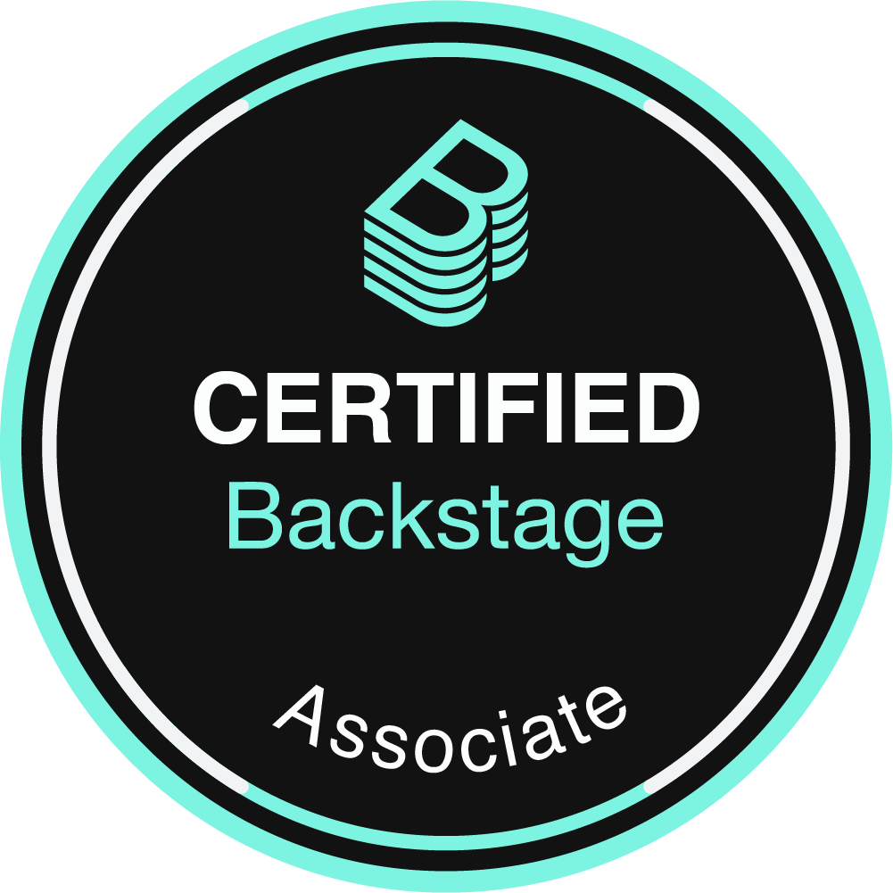
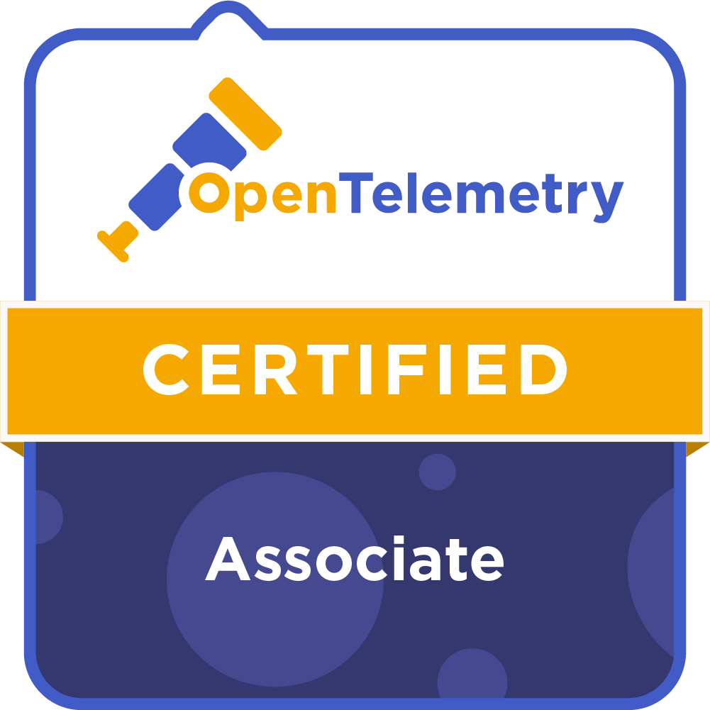

# Hi there 👋

I'm Chris, a Senior Cloud Native Architect and Engineer as well as an IT-Coach based in  <b>Nürnberg, Germany</b>.

## Main Areas of Interest

  <!-- infrastructure -->
  
  
  
  
  
  
  
  
  
  <!-- monitoring -->
  
  
  
  <!-- git gud -->
  
  
  
  

### Certifications

  
  
  
  
  
  
  
  
  
  
  
  
  
  
  
  
  
  
  
  
  
  
  
  
  
  
  
  
  
  
  
  
  
  
  
  
  
  
  
  
  
  

## Me in the WWW

[//]: <> (Icons from https://simpleicons.org)

  
  
  
  
  
  
  
  
  <a href="https://openprofile.dev/profile/christian.knell" target="_blank">
    
  
  
  
  
  

### 📊 My Github Stats

|    |
| :---: |

|  |  |
| :---: | :---: |

#### Recent Activities

<!--START_SECTION:activity-->
1. 🎉 Merged PR [#1905](https://github.com/christianhuth/helm-charts/pull/1905) in [christianhuth/helm-charts](https://github.com/christianhuth/helm-charts)
2. 💪 Opened PR [#1905](https://github.com/christianhuth/helm-charts/pull/1905) in [christianhuth/helm-charts](https://github.com/christianhuth/helm-charts)
3. 🎉 Merged PR [#1904](https://github.com/christianhuth/helm-charts/pull/1904) in [christianhuth/helm-charts](https://github.com/christianhuth/helm-charts)
4. 💪 Opened PR [#1904](https://github.com/christianhuth/helm-charts/pull/1904) in [christianhuth/helm-charts](https://github.com/christianhuth/helm-charts)
5. 🎉 Merged PR [#1903](https://github.com/christianhuth/helm-charts/pull/1903) in [christianhuth/helm-charts](https://github.com/christianhuth/helm-charts)
<!--END_SECTION:activity-->
